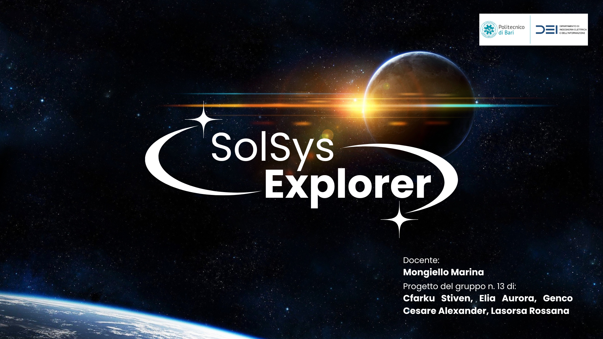

# SolSys Explorer

SolSys Explorer è un'applicazione interattiva che permette di esplorare il Sistema Solare in 3D. Sviluppato da un team di quattro studenti di Ingegneria Informatica e dell'Automazione al Politecnico di Bari (Aurora Elia, Rossana Lasorsa, Cesare Alexander Genco, Stiven Cfarku) per il progetto d'esame di Ingegneria del Software che sarà presentato il 17 Gennaio 2025, SolSys Explorer offre un'esperienza immersiva e didattica, adatta a chiunque sia affascinato dallo spazio.

## Caratteristiche Principali

*   **Esplorazione 3D del Sistema Solare:** Pilota una navicella spaziale attraverso una fedele riproduzione del Sistema Solare, con pianeti in scala e accuratamente dettagliati, inclusi i loro satelliti e gli asteroidi.
*   **Due modalità di visualizzazione:**
    *   **Esplorazione con Navicella:** Visuale in prima persona, terza persona e terza persona con FOV allargato, per un'esperienza di volo immersiva. Controlli della navicella intuitivi e reattivi.
    *   **Sistema Solare in Miniatura:** Visuale dall'alto dell'intero Sistema Solare, con possibilità di spostarsi liberamente trascinando la freccia del mouse e di zoomare con la rotellina o con il touchpad.
*   **Tablet Interattivo:** Accedi a un tablet virtuale con cinque funzionalità principali:
    *   **Informazioni Pianeti:** Scopri informazioni dettagliate su ogni pianeta, inclusa la loro stratificazione interna, con modelli 3D interattivi che puoi ruotare e osservare da vicino.
    *   **Leggi dello Spazio:**  Impara le principali leggi che governano il moto dei corpi celesti, come le leggi di Keplero, con spiegazioni teoriche e GIF animate illustrative.
    *   **Impostazioni:** Personalizza la tua esperienza scegliendo tra lingua italiana e inglese, consulta una legenda dei comandi, e attiva o disattiva il volume.
    *   **Esplorazione:** Passa alla modalità di esplorazione con la navicella spaziale.
    *   **Esci:** Chiudi l'applicazione.
*   **Pannello informativo per ogni pianeta (in modalità Miniatura):** Seleziona un pianeta da un menu a tendina per visualizzare informazioni aggiuntive come la distanza dal Sole, la velocità di rotazione e una curiosità accompagnata da un'immagine o un video.
*   **Controllo della velocità di rotazione (in modalità Miniatura):** Usa uno slider per aumentare, diminuire o fermare la velocità di rotazione dei pianeti attorno al Sole.
*   **Prestazioni elevate:** Il gioco gira a 60fps in qualità Full HD o 4K, garantendo un'esperienza fluida e visivamente appagante.

## Comandi

*   **V:** Cambia la visuale della navicella (prima persona, terza persona, terza persona con FOV allargato).
*   **WASD o tasti direzionali:** Sposta la navicella rispettivamente avanti, sinistra, dietro, destra.
*   **QE:** Ruota la visuale a sinistra e a destra rispettivamente.
*   **Shift:** Aumenta la velocità della navicella.
*   **ESC:** Apre il tablet (non disponibile in modalità Miniatura).
*   **M:** Passa dalla modalità Esplorazione con Navicella alla modalità Sistema Solare in Miniatura e viceversa.
*   **Mouse o touchpad (in modalità Miniatura):**
    *   **Trascinamento:** Sposta la visuale sul Sistema Solare.
    *   **Rotellina/Touchpad con due dita:** Zooma avanti e indietro.
*   **Click su icona Astronave (in modalità Miniatura):** Torna alla modalità Esplorazione con Navicella.
*   **Trascinamento slider (in modalità Miniatura):** Aumenta o diminuisci la velocità di rotazione dei pianeti attorno al sole.

## Interfaccia Utente

L'interfaccia utente è progettata per essere intuitiva e facile da usare. All'avvio, l'applicazione presenta una schermata iniziale con il logo del gioco e un pulsante "Inizia". Una volta entrati nel vivo del gioco, il tablet interattivo diventa il centro di controllo principale, permettendo di accedere a tutte le funzionalità educative e di navigazione.

## Obiettivi del Progetto

Solsys Explorer è stato sviluppato come progetto per l'esame di Ingegneria del Software da un team di quattro studenti universitari. L'obiettivo era quello di creare un'applicazione che combinasse l'aspetto ludico dell'esplorazione spaziale con un forte valore educativo, offrendo agli utenti un modo interattivo e coinvolgente per imparare di più sul Sistema Solare.

## Requisiti di Sistema

* Sistemi Operativi Supportati:
   * Windows (x64)
   * macOS (X64-ARM)
   * Linux (x64 debian)

## Installazione

Per installare Solsys Explorer:

* Vai alla sezione [[Releases](https://github.com/97ros/solarsystem_new/releases)] di questa repository.

* Scarica il file di installazione corretto della versione più recente per il tuo sistema operativo:
   * **Windows:** SolSys Explorer Setup (Windows x64).exe
   * **macOS:** SolSys.Explorer.app.zip (x64-ARM)
   * **Linux:** solsys-explorer-linux.deb (x64)

* Apri il file scaricato e segui le istruzioni a schermo per completare l'installazione.

## Ringraziamenti
Un ringraziamento speciale ai membri del team per il loro contributo a questo progetto:
*   Aurora Elia - @auroraaelia
*   Rossana Lasorsa - @97ros
*   Cesare Alexander Genco - @Cesare0903
*   Stiven Cfarku - @StivenC03

## Feedback e Supporto

Incoraggiamo gli utenti a fornire feedback e segnalare eventuali bug o problemi riscontrati tramite la sezione "Issues" di questa repository GitHub.

**Scarica Solsys Explorer e inizia il tuo viaggio alla scoperta del Sistema Solare!**
